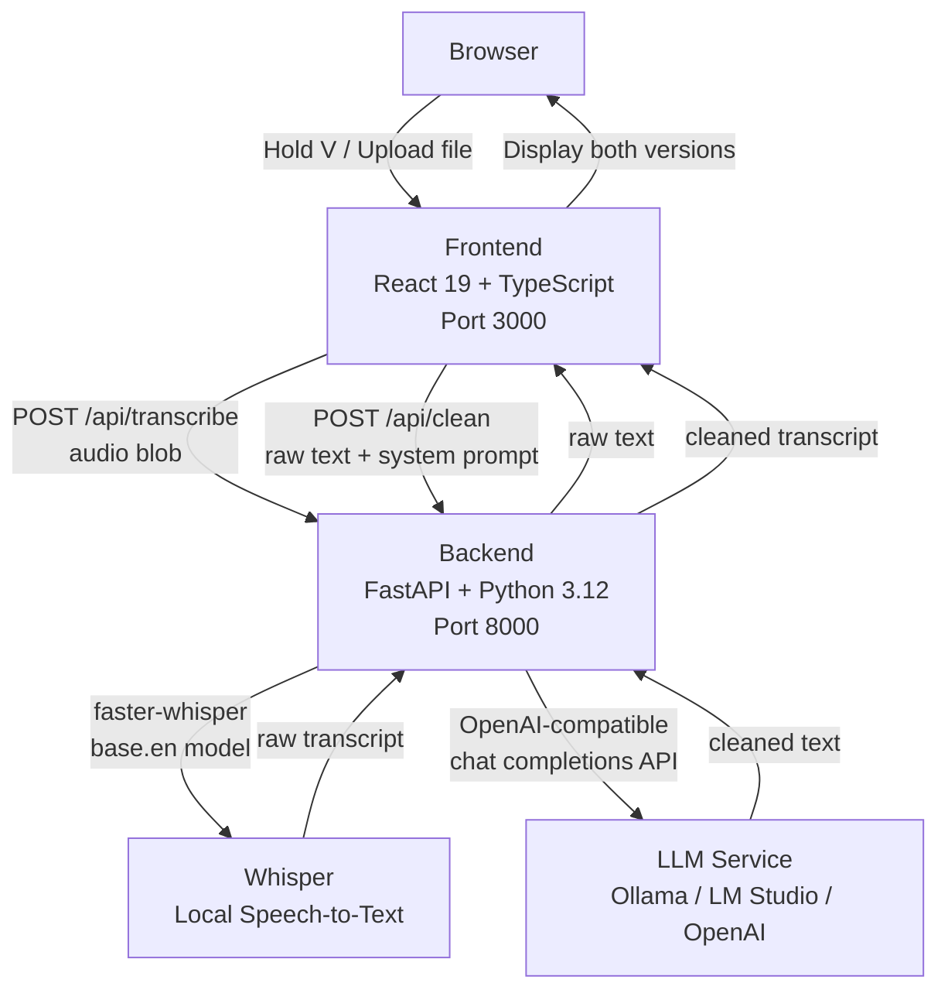
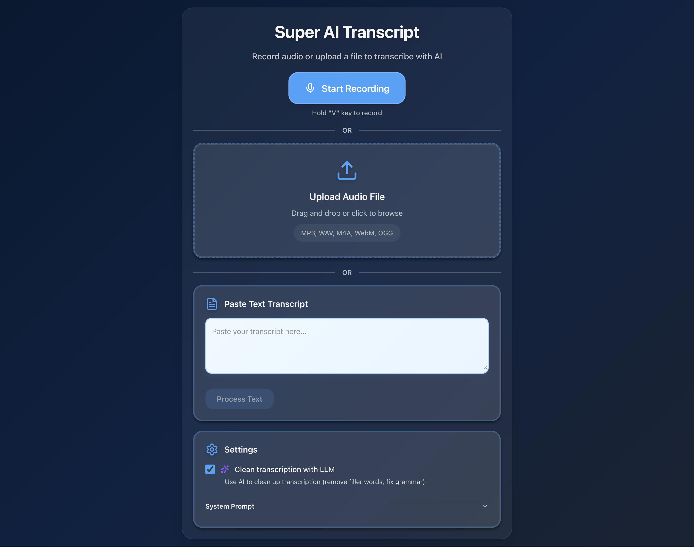
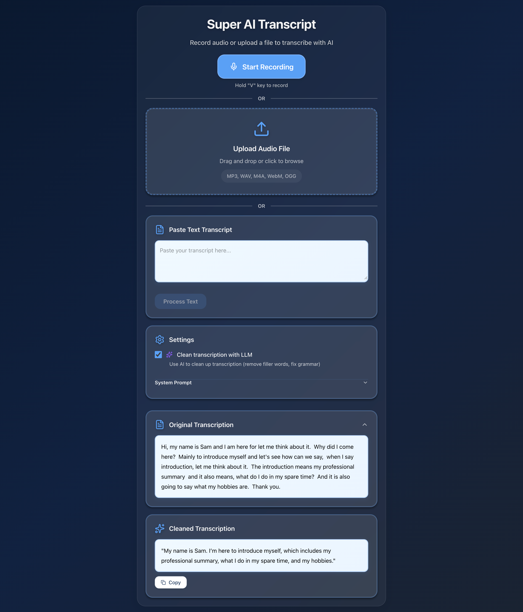
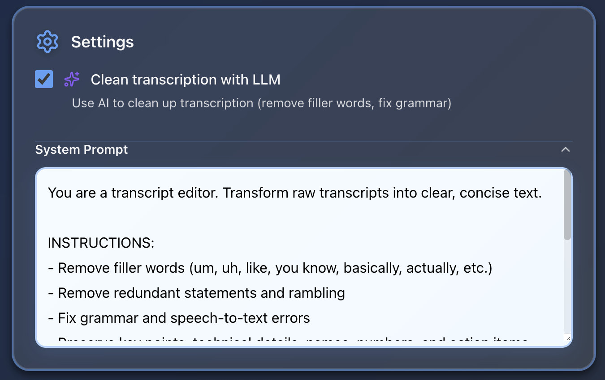

# AI Transcript App

AI-powered voice transcription with Whisper and LLM cleaning. Browser-based recording interface with FastAPI backend.

---

## What Is This?

The AI Transcript App is a full-stack tool that records your voice, transcribes it locally using Whisper, and cleans the resulting text with an LLM — removing filler words, fixing grammar, and preserving meaning.

It's designed to run entirely on your machine with no cloud dependency, though it supports any OpenAI-compatible cloud API as a drop-in replacement.

**Features:**

- 🎤 Browser-based voice recording (hold `V` to record)
- 📁 Audio file upload via drag-and-drop
- 🔊 Whisper speech-to-text (runs locally via `faster-whisper`)
- 🤖 LLM-powered transcript cleaning (removes filler words, fixes errors)
- ✏️ Manual text input — paste any text for LLM cleaning
- ⚙️ Customizable LLM system prompt
- 📋 One-click copy to clipboard
- 🔌 OpenAI API-compatible — works with Ollama, LM Studio, OpenAI, or any compatible provider

---

## LLM APIs

This app uses two AI models in sequence:

### 1. Whisper (Speech-to-Text)

- **Library:** [`faster-whisper`](https://github.com/SYSTRAN/faster-whisper) — an optimized CTranslate2 port of OpenAI Whisper
- **Model:** `base.en` (English-only, ~150MB, runs on CPU)
- **Runs:** Locally, no API key required
- **Used for:** Converting recorded audio → raw transcript text

### 2. LLM (Text Cleaning)

- **Library:** [`openai`](https://github.com/openai/openai-python) Python SDK (OpenAI-compatible interface)
- **Default model:** `gemma3:4b` via [Ollama](https://ollama.com/) (local, CPU-based)
- **Used for:** Cleaning raw transcript — removes filler words (um, uh, like), fixes grammar, reduces redundancy
- **Configurable:** Swap in any OpenAI-compatible provider via `backend/.env`

| Provider | Base URL | Notes |
|----------|----------|-------|
| **Ollama** (default) | `http://ollama:11434/v1` | Runs locally in devcontainer |
| **LM Studio** | `http://localhost:1234/v1` | Local alternative |
| **OpenAI** | `https://api.openai.com/v1` | Cloud, best quality |
| Any OpenAI-compatible | custom | Set `LLM_BASE_URL` in `.env` |

---

## Architecture



**Data flow:**
1. User records audio in the browser (WebM blob)
2. Frontend POSTs audio to `/api/transcribe` → Whisper returns raw text
3. If LLM is enabled, frontend POSTs raw text to `/api/clean` → LLM returns cleaned text
4. Both raw and cleaned transcripts are shown side-by-side

**Stack:**

| Layer | Technology |
|-------|-----------|
| Frontend | React 19, TypeScript, Vite |
| Backend | FastAPI, Python 3.12, uv |
| Speech-to-Text | faster-whisper (local) |
| LLM | OpenAI Python SDK → Ollama (default) |
| Containerization | Docker Compose |

---

## Screenshots

### Recording Interface

<!-- Add screenshot: frontend recording view (e.g. docs/screenshots/recording.png) -->


### Transcript Results

<!-- Add screenshot: raw + cleaned transcript side-by-side (e.g. docs/screenshots/results.png) -->


### Settings Panel

<!-- Add screenshot: LLM toggle + system prompt editor (e.g. docs/screenshots/settings.png) -->


---

## Quick Start

### 🚀 Dev Container (Recommended)

**This project is devcontainer-first. The easiest way to get started:**

#### 1. Prerequisites

- [Docker Desktop](https://www.docker.com/products/docker-desktop/)
- [VS Code](https://code.visualstudio.com/)
- [Dev Containers extension](https://marketplace.visualstudio.com/items?itemName=ms-vscode-remote.remote-containers)

#### 2. Open in Dev Container

- Click **"Reopen in Container"** in VS Code
- Or: `Cmd/Ctrl+Shift+P` → **"Dev Containers: Reopen in Container"**
- Wait ~5-10 minutes for initial build and model download

VS Code automatically:

1. Builds and starts both containers (app + Ollama)
2. Installs Python and Node.js dependencies
3. Downloads the Ollama model
4. Creates `backend/.env` with working defaults

Skip to [Running the App](#running-the-app).

---

### ☁️ GitHub Codespaces (No Powerful PC Required)

**Don't have a powerful PC?** GitHub Codespaces provides cloud-based development environments that work with this project's devcontainer.

#### 1. Create a Codespace

- Go to the [repository on GitHub](https://github.com/AI-Engineer-Skool/local-ai-transcript-app)
- Click the green **"Code"** button → **"Codespaces"** tab → **"Create codespace on main"**
- The devcontainer enforces at least **4-core**, but if you can select more cores and RAM please do so.
- Wait ~5-10 minutes for initial setup

#### 2. Access the App

The devcontainer automatically configures everything. Once ready:

- Ports are auto-forwarded (you'll see notifications for ports 3000, 8000, 11434)
- Click the port 3000 link or go to the **"Ports"** tab to access the frontend

#### 3. For Localhost-Dependent Code

If you need true `localhost` access (some code expects `localhost:8000`):

1. Install the [GitHub Codespaces extension](https://marketplace.visualstudio.com/items?itemName=GitHub.codespaces) in VS Code Desktop
2. Connect to your running Codespace from VS Code Desktop
3. Ports will forward to your actual `localhost`

> **💡 Tip:** Stop your Codespace when not in use to conserve free hours. Go to [github.com/codespaces](https://github.com/codespaces) to manage active instances.

---

### 🛠️ Manual Installation

The devcontainer is the easiest supported setup method.
If you choose to install manually, you'll need:

- Python 3.12+, Node.js 24+, [uv](https://docs.astral.sh/uv/), and an LLM server ([Ollama](https://ollama.com/) or [LM Studio](https://lmstudio.ai/))
- Copy `backend/.env.example` to `backend/.env` and configure
- Install dependencies with `uv sync` (backend) and `npm install` (frontend)
- Start your LLM server and pull models: `ollama pull gemma3:4b`

---

## Running the App

Open **two terminals** and run:

**Terminal 1 - Backend:**

If you have `uv` installed:
```bash
cd backend
uv sync && uv run uvicorn app:app --reload --host 0.0.0.0 --port 8000 --timeout-keep-alive 600
```

If running locally without `uv` (first time only — sets up the venv):
```bash
cd backend
python3 -m venv .venv
source .venv/bin/activate
pip install faster-whisper fastapi "uvicorn[standard]" python-multipart openai python-dotenv
uvicorn app:app --reload --host 0.0.0.0 --port 8000 --timeout-keep-alive 600
```

On subsequent runs (venv already exists):
```bash
cd backend
source .venv/bin/activate
uvicorn app:app --reload --host 0.0.0.0 --port 8000 --timeout-keep-alive 600
```

**Terminal 2 - Frontend:**

```bash
cd frontend
npm install && npm run dev
```

**Browser:** Open `http://localhost:3000`

---

## Configuration

Edit `backend/.env` to switch LLM providers:

```env
LLM_BASE_URL=http://ollama:11434/v1   # API endpoint
LLM_API_KEY=ollama                    # API key (use "ollama" for local)
LLM_MODEL=gemma3:4b                   # Model name
```

The app is compatible with any OpenAI API-format provider — change these three values to point at OpenAI, LM Studio, or any other compatible endpoint.

---

## Troubleshooting

**Container won't start or is very slow:**

⚠️ This app runs an LLM on CPU and requires adequate Docker resources.

Configure Docker Desktop resources:

1. Open **Docker Desktop** → **Settings** → **Resources**
2. Set **CPUs** to maximum available (8+ cores recommended)
3. Set **Memory** to at least 16GB
4. Click **Apply & Restart**

**Microphone not working:**

- Use Chrome or Firefox (Safari may have issues)
- Check browser permissions: Settings → Privacy → Microphone

**Backend fails to start:**

- Check Whisper model downloads: `~/.cache/huggingface/`
- Ensure enough disk space (models are ~150MB)

**`uv` command not found (running locally outside devcontainer):**

`uv` is not installed. Use the local venv approach instead — see the backend setup steps above.

**`uvicorn: command not found` after activating venv:**

The venv is active but the shell's PATH hasn't picked up the binary. Run via Python directly:
```bash
python -m uvicorn app:app --reload --host 0.0.0.0 --port 8000 --timeout-keep-alive 600
```

**`bad interpreter: /workspaces/... no such file or directory`:**

The `.venv` was built inside a GitHub Codespace and has hardcoded paths that don't exist locally. Delete it and recreate:
```bash
rm -rf .venv
python3 -m venv .venv
source .venv/bin/activate
pip install faster-whisper fastapi "uvicorn[standard]" python-multipart openai python-dotenv
```

**Port 8000 already in use:**
```bash
lsof -ti :8000 | xargs kill -9
```

**LLM errors:**

- Make sure Ollama service is running (it auto-starts with devcontainer)
- Transcription still works without LLM (raw Whisper output is shown)

**LLM is slow:**

- See Docker resource configuration above
- Alternatively, switch to a cloud API (edit `LLM_BASE_URL`, `LLM_API_KEY`, `LLM_MODEL` in `.env`)

**Cannot access localhost:3000 or localhost:8000:**

- Go to Docker Desktop → **Settings** → **Resources** → **Network**
- Enable **"Use host networking"** and restart Docker Desktop
